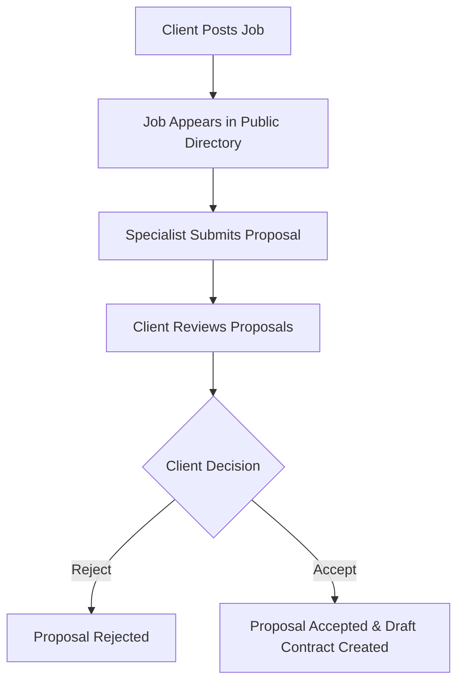
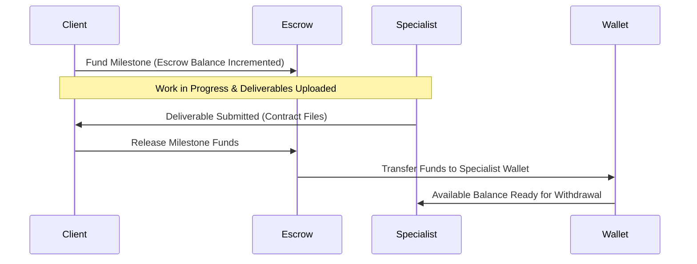
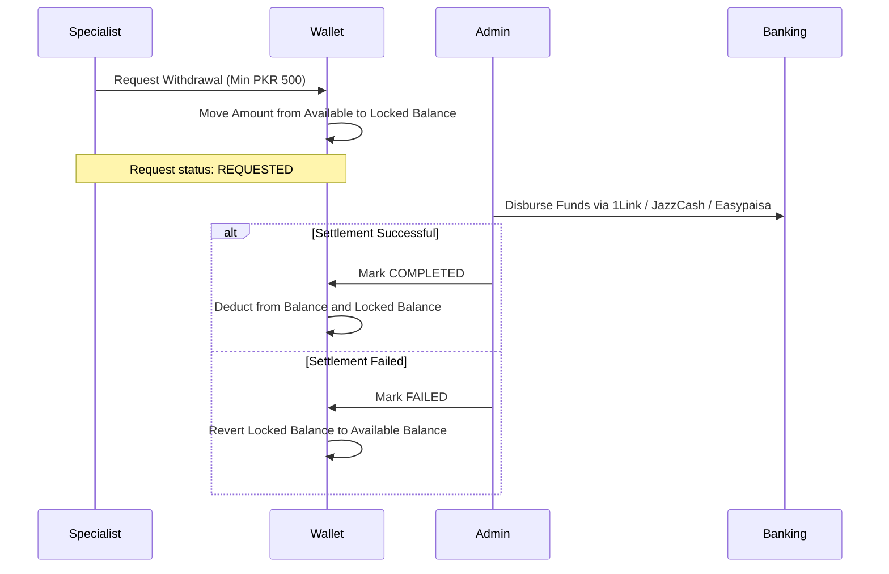

# Features & Roles Specification

This document details the feature set of the Paklance platform, the role-based access control (RBAC) architecture, and the end-to-end operational lifecycles.

---

## 1. User Roles

Paklance enforces three primary user roles:

| Role | Target Persona | Primary Responsibilities |
|---|---|---|
| **`CLIENT`** | Businesses, Project Owners | Post job requirements, evaluate proposals, hire specialists, create contracts, fund escrow accounts, approve milestones, and leave client reviews. |
| **`SPECIALIST`** | Freelancers, Agencies | Browse jobs, submit proposals, deliver milestones, manage public portfolio, submit identity verification, receive escrow funds, and withdraw earnings. |
| **`ADMIN`** | Platform Operations & Support | Oversee platform health, reconcile payments, arbitrate disputes, verify specialist identity credentials, approve withdrawal settlements, and maintain system data integrity. |

---

## 2. Role-Based Access Control (RBAC) Matrix

| Module / Action | Public / Guest | `CLIENT` | `SPECIALIST` | `ADMIN` |
|---|:---:|:---:|:---:|:---:|
| **Account Registration & OTP Verification** | :white_check_mark: | :white_check_mark: | :white_check_mark: | :white_check_mark: |
| **Google OAuth Sign-in** | :white_check_mark: | :white_check_mark: | :white_check_mark: | :white_check_mark: |
| **Browse / Search Specialists** | :white_check_mark: | :white_check_mark: | :white_check_mark: | :white_check_mark: |
| **Browse / Search Jobs** | :white_check_mark: | :white_check_mark: | :white_check_mark: | :white_check_mark: |
| **Post / Update Job** | :x: | :white_check_mark: (Owner) | :x: | :white_check_mark: |
| **Submit Proposal** | :x: | :x: | :white_check_mark: | :x: |
| **View Proposals for Job** | :x: | :white_check_mark: (Job Owner) | :x: | :white_check_mark: |
| **Create & Fund Contract Escrow** | :x: | :white_check_mark: | :x: | :white_check_mark: |
| **Upload Contract Deliverable** | :x: | :white_check_mark: (Contract Party) | :white_check_mark: (Contract Party) | :white_check_mark: |
| **Release Milestone Payment** | :x: | :white_check_mark: (Contract Party) | :x: | :white_check_mark: |
| **Raise Dispute** | :x: | :white_check_mark: (Contract Party) | :white_check_mark: (Contract Party) | :white_check_mark: |
| **Resolve Dispute** | :x: | :x: | :x: | :white_check_mark: |
| **Request Wallet Withdrawal** | :x: | :white_check_mark: | :white_check_mark: | :white_check_mark: |
| **Process / Settle Withdrawal** | :x: | :x: | :x: | :white_check_mark: |
| **View Platform Financial Stats** | :x: | :x: | :x: | :white_check_mark: |
| **Submit Identity Verification** | :x: | :x: | :white_check_mark: | :x: |
| **Approve / Reject Verification** | :x: | :x: | :x: | :white_check_mark: |

---

## 3. Core Feature Workflows

### 3.1 Job Posting & Hiring Flow

1. **Job Creation**: Client specifies title, detailed requirements, budget in PKR, and target skill tags.
2. **Specialist Proposal**: Specialist bids with custom price, delivery timeline in days, and a tailored cover letter.
3. **Acceptance**: When the client accepts a proposal:
   - The selected proposal status is changed to `ACCEPTED`.
   - Competing proposals for that job are marked `REJECTED`.
   - A `Contract` record is initialized in `DRAFT` status with corresponding client and specialist relations.

---

### 3.2 Escrow & Milestone Payment Lifecycle

1. **Funding**: Client funds a contract milestone using their platform wallet balance or direct gateway payment (JazzCash / Easypaisa).
2. **Escrow Holding**: Funds are locked safely in the contract's `Escrow` balance. Neither client nor specialist can unilaterally withdraw these funds.
3. **Collaboration & Deliverables**: Parties exchange project files (up to 3MB) and communicate in the dedicated chat thread.
4. **Milestone Release**: Upon satisfactory delivery, the client triggers milestone release:
   - Milestone status changes to `RELEASED`.
   - Funds move atomically from the `Escrow` record to the specialist's `Wallet` balance.
   - An immutable `WalletTransaction` audit entry is created.

---

### 3.3 Two-Phase Withdrawal & Settlement Flow

1. **Reservation Phase**: When a withdrawal request is created:
   - System verifies that `availableBalance` (`balance - lockedBalance`) is greater than or equal to the requested amount.
   - Funds are locked (`lockedBalance += amount`) without altering total `balance`. This guarantees money cannot be double-spent while the request is pending.
   - The user may cancel the request while in `REQUESTED` status, which immediately restores available balance.
2. **Settlement Phase (Admin)**:
   - `PROCESSING`: Payout is in progress with the bank or 1Link gateway.
   - `COMPLETED`: Funds were successfully remitted. The backend atomically deducts the amount from both `balance` and `lockedBalance`.
   - `FAILED`: Payout was rejected (e.g. invalid account title or IBAN). Locked funds are restored to available balance.

---

### 3.4 Dispute Resolution Lifecycle
1. Either contract participant may raise a dispute if deliverables or terms are in disagreement.
2. When a dispute is created:
   - The contract status is updated to `DISPUTED`.
   - Milestone release and refund operations are temporarily frozen.
3. The Admin reviews the contract communications, deliverable attachments, and dispute claims in the Admin Console.
4. The Admin enters an official resolution note and marks the dispute `RESOLVED` or `CLOSED`, unlocking escrow according to arbitration terms.

---

### 3.5 Messaging & Real-Time Sync
- **Thread Auto-Creation**: Conversations are automatically initialized when two users initiate contact or accept proposals.
- **Delivery & Read States**: Messages track `isDelivered` and `isRead` states. When the recipient views the conversation, pending messages are marked read and delivered.
- **Unsend Capability**: Senders can retract/delete their sent messages.
